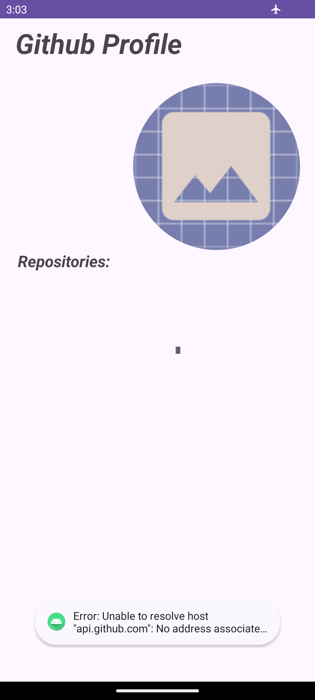
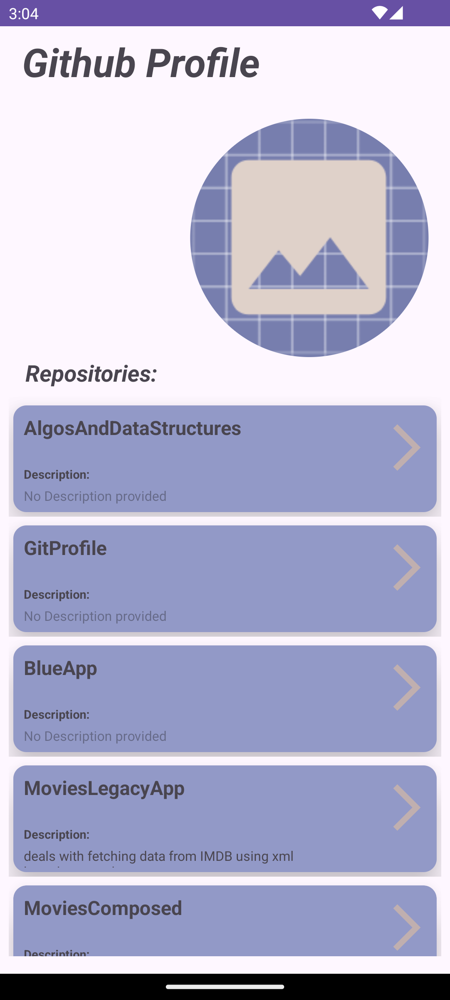
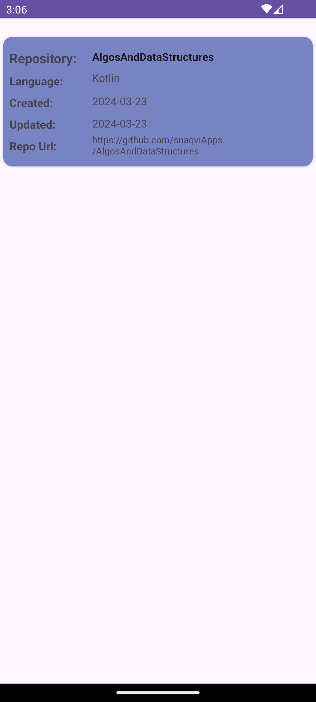

This application provides the list of public repositories. It demos the legacy app development (XML) based, (it currently) features the MVVM architecture pattern with below: 
- ViewModel, ViewBinding, LiveData, Retfoit, Dagger
- **For now the landing page looks as below**

**This app displays repository's ownewr basic information**

- Brief steps intro landing steps:

<table>
  <tr>
    <td>Opening screen, custom progressBar</td>
     <td>repos list, with avatar placeholder </td>
     <td>click on image-placeholder to uncover its</td>
     <td>Detail Screen</td>
  </tr>
  <tr>
    <td></td>
    <td></td>
    <td></td>
    <td></td>
  </tr>
 </table>

